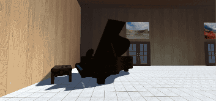
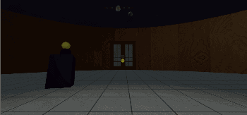
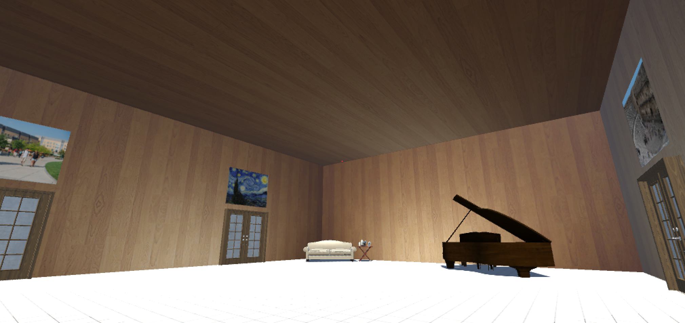
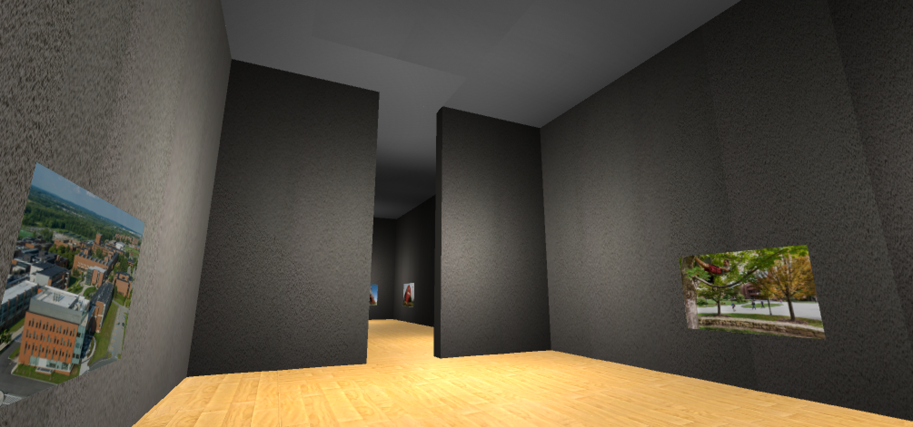
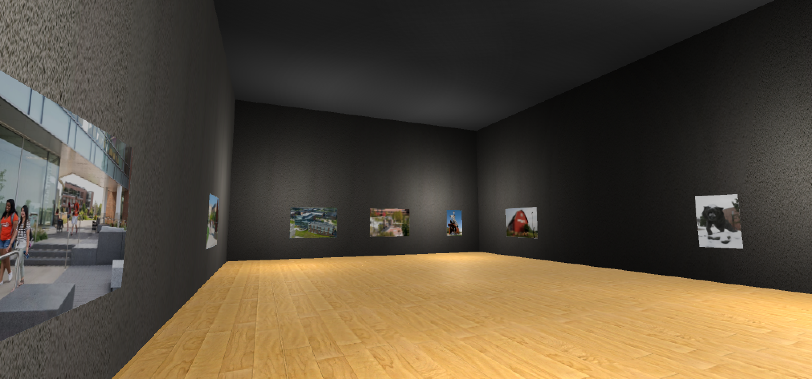
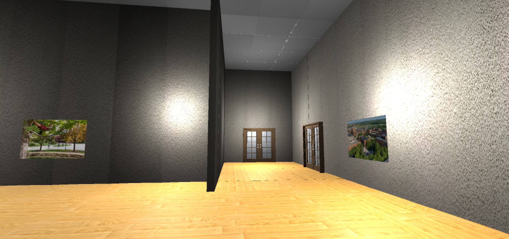
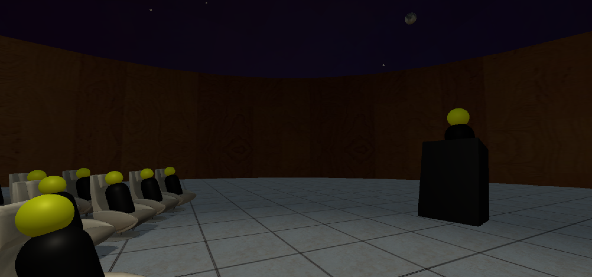
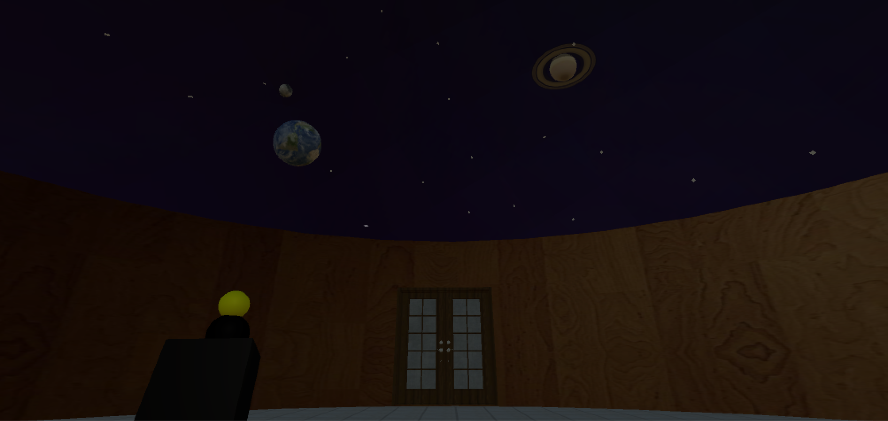

# Virtual Reality Photo Album
Keeping a digital photo collection is a commonplace these days. Yet most picture viewing applications dismiss the idea of providing any immersive viewing experience. As a virtual reality application, this project focuses on presenting a users’ digital photo collection in a procedurally generated art exhibit.

## Project Idea and design
Our main philosophical approach, while designing the application, was to think of it as a photo viewing application set in 3D space. Photo viewing applications generally have a few defining characteristics:

* Pictures are organized across albums
* Users are allowed to inspect any picture of an album at will
* For a more passive viewing experience, a slideshow feature is provided

### Lobby
To reflect on these traits, our approach involved spawning the user in a Lobby scene first.Aside from the general decorations, the Lobby scene comprises of a bunch of doors. Each door is representative of an album. Hanging above the door, is a billboard that previews photos in that album.

### Art Gallery
 On entering the door, the user is taken to the Art Gallery scene. The art gallery comprises of a series of adjacent rooms with pictures hanging on walls. To ensure architectural variation and adequate containment of all the pictures of an album, the art gallery is procedurally generated.

### Planetarium
 The art gallery also has another door that leads to the Planetarium scene. This scene is akin to the slideshow feature found in most picture viewers. With an alluring space environment set as backdrop, the user can enjoy the successive emergence of all the pictures in the album.

## App Screenshots

Each door of the lobby is representative of an album that leads to its art gallery.

Art gallery is procedurally generated to adequately contain all the pictures of the album

Picture placement is also procedural taking into account the total perimeter requirement

The door in the front leads back to the lobby, and the one on the right leads to the planetarium

Planetarium comprises of the user seated amongst the audience who are looking at the skyline.

Slideshow of all pictures of the current album are displayed in the skyline

The door in front leads back to the art gallery
